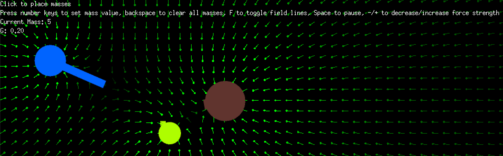

# gravity-simulation

This is a simple 2D simulation of gravitational forces between masses. It is written in Go and uses [Ebitengine](https://ebitengine.org) for rendering.



# Usage
A hosted instance of this simulation can be found [here](https://gravity.hexagon.monster).

The controls are as follows:
- `Number keys`: Set the current mass to the corresponding value (or 10 for the zero key).
- `Backspace`: Clear all masses.
- `Space`: Pause/unpause the simulation.
- `F`: Toggle display of field lines.
- `+/-`: Increase/decrease the strength of the gravitational force (modifies the constant `G`).
- `Scroll wheel`: Move around the simulation.

# Building
Before building, make sure you have the following dependencies installed:
- Go 1.23 or later
- A working C compiler (for Ebitengine)

## Local
```bash
go mod tidy
go build
```

## WebAssembly
```bash
go mod tidy
GOOS=js GOARCH=wasm go build -o gravity-simulation.wasm
```
